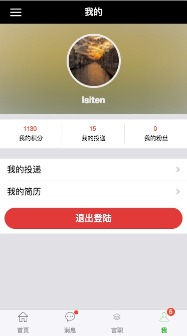

# 握手App
> Vue全家桶（Vue+Vuex+Vue Router+Axios）+ vux 
>
> 一款给找工作的提供工作，给提供工作的提供平台，实现双赢的求职App
## 声明
该App创意来源于拉钩网，部分ui仿照拉钩网，但该项目仅供学习

## 参考资料

Vux文档 : [https://vux.li/#/](https://vux.li/#/)

vue2.0中文文档 : [https://vuefe.cn/v2/guide/](https://vuefe.cn/v2/guide/)

vue-router文档 : [https://router.vuejs.org/](https://router.vuejs.org/)

vuex文档 : [https://vuex.vuejs.org/](https://vuex.vuejs.org/)

数据请求axios : [https://www.npmjs.com/package/axios](https://www.npmjs.com/package/axios)

## 技术栈
>1、Vue.js
>
>2、Vuex【controller(视图控制器) -> actions-> mutations->state->view(视图)】
>
>3、Axios
>
>4、Vue Router
>
>7、localstorage实现数据本地持久话
>
>8、[iconfont图标库的使用](http://iconfont.cn/)
>
>9、螺丝帽Api实现短信验证码
>
>10、七牛图床上传
>
>11、cloudinary图床上传
>

## APP功能【部分工作在实现中...】
>1、首页banner，职位简介信息拉取，职位详情页
>
>2、消息模块 与主管交谈会话列表，与主管会话，简历投递状态 
>
>3、言职 话题数据拉取，话题详情，发布评论，发布话题
>
>4、用户信息修改，头像上传，简历编辑，退出登陆

# 界面预览
## 首页

## 言职

## 我的


## 开启app

``` bash
# 安装依赖
npm install

# 打开dev环境
npm run dev

```
